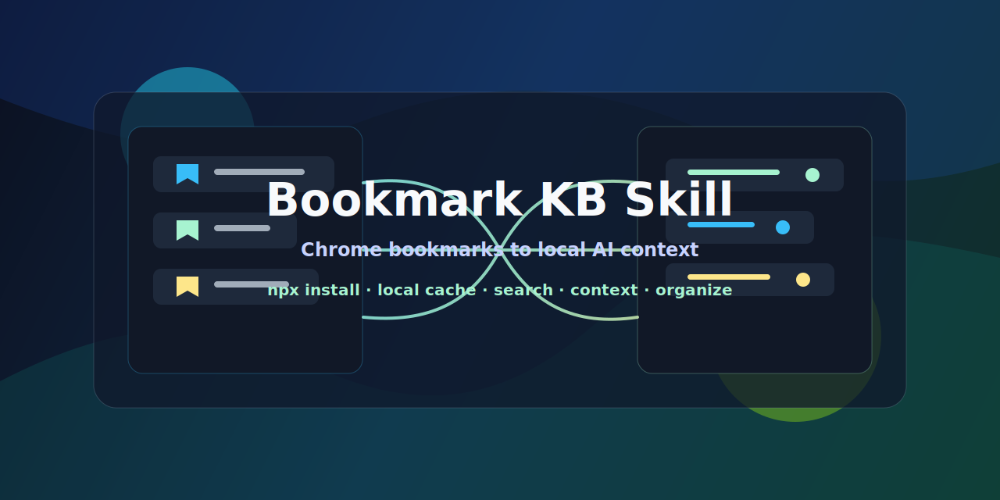

<p align="center">
  
</p>

<p align="center">
  <a href="docs/README.zh-CN.md">中文</a>
  ·
  <a href="#agent-quick-install">Agent Quick Install</a>
  ·
  <a href="#human-installation">Human Installation</a>
</p>

<p align="center">
  <a href="https://github.com/RUDY-GAOJ/bookmark-kb-skill/actions/workflows/ci.yml"></a>
  <a href="https://github.com/RUDY-GAOJ/bookmark-kb-skill/releases/tag/v0.1.0"></a>
  <a href="https://github.com/RUDY-GAOJ/bookmark-kb-skill/blob/main/LICENSE"></a>
</p>

# Bookmark KB Skill

Turn messy Chrome bookmarks into a plug-and-play AI knowledge base.

Still losing saved pages inside an overflowing bookmarks bar? Struggling to remember where you saved that one great resource? Want to clean up a huge bookmark collection, but have no idea where to begin? `bookmark-kb-skill` turns your Chrome bookmarks into local AI-ready context that agents can search, cite, and organize on demand.

Its core job is not to manage skills. Its job is to make your saved links useful again: find forgotten resources, gather task-specific context, build source bundles, and review duplicate or messy bookmarks without crawling websites on every query. The installer simply makes that bookmark knowledge workflow easy to drop into the AI agent platforms you already use.

The user-facing interface is npm/npx. The package keeps a small Python standard-library script internally for portable local bookmark processing, but humans and agents call `bookmark-kb-skill` or `bookmark-kb`.

## Agent Quick Install

Copy this into your AI coding agent:

```text
Install bookmark-kb-skill into this project for Codex. Use:
npm exec --yes --package github:RUDY-GAOJ/bookmark-kb-skill -- bookmark-kb-skill install --platforms=codex --scope=project --overwrite
Then refresh my Chrome bookmarks and search them when I ask bookmark-related questions.
```

For Codex + Claude:

```text
Install bookmark-kb-skill into this project for Codex and Claude. Use:
npm exec --yes --package github:RUDY-GAOJ/bookmark-kb-skill -- bookmark-kb-skill install --platforms=codex,claude --scope=project --overwrite
Then use bookmark-kb-skill when I ask to search, use, or organize my Chrome bookmarks.
```

For Codex + Claude + OpenClaw + Hermes:

```text
Install bookmark-kb-skill into this project for Codex, Claude, OpenClaw, and Hermes. Use:
npm exec --yes --package github:RUDY-GAOJ/bookmark-kb-skill -- bookmark-kb-skill install --platforms=codex,claude,openclaw,hermes --scope=project --overwrite
Then use bookmark-kb-skill when I ask to search, use, or organize my Chrome bookmarks.
```

## Human Installation

After npm publication:

```sh
npx bookmark-kb-skill install --platforms=codex --scope=project --overwrite
```

Install into more than one platform:

```sh
npx bookmark-kb-skill install --platforms=codex,claude,openclaw,hermes --scope=project --overwrite
```

Install from GitHub before npm publication:

```sh
npm exec --yes --package github:RUDY-GAOJ/bookmark-kb-skill -- bookmark-kb-skill install --platforms=codex --scope=project --overwrite
```

Install from a local checkout:

```sh
npm exec --package . -- bookmark-kb-skill install --platforms=codex --scope=project --overwrite
```

Supported platform ids:

- `codex`
- `claude`
- `gemini`
- `cursor`
- `opencode`
- `openclaw`
- `hermes`

Project scope installs under the current directory. Global scope installs under the user profile where supported:

```sh
npx bookmark-kb-skill install --platforms=codex --scope=global --overwrite
```

## Features

- Read the default Chrome `Bookmarks` file, or use `--bookmarks-file` for another profile.
- Cache normalized bookmark records locally under `~/.bookmark-kb`.
- Search by title, URL, folder path, category, and tags without crawling websites on every query.
- Export compact context bundles for later AI tasks.
- Export organization reports without modifying Chrome bookmarks.
- Install quickly into Codex, Claude, Gemini, Cursor, OpenCode, OpenClaw, or Hermes so the same bookmark knowledge workflow is available wherever you work.
- Use Markdown output by default and JSON output with `--json`.

## Use Cases

- Ask an agent to find a saved article, tool, or documentation page when you only remember the topic.
- Turn a group of bookmarked links into a compact context bundle for writing, research, planning, or coding.
- Review duplicate links and messy folders before doing a manual cleanup.
- Keep bookmark search local and low-token instead of pasting full bookmark exports into every chat.

## Requirements

- Node.js 20 or newer.
- npm 10 or newer.
- Python available as `python` on Windows or `python3` / `python` on macOS and Linux.

Set `BOOKMARK_KB_PYTHON` if Python is installed at a custom path.

## Use The Bookmark CLI

Refresh the local cache:

```sh
bookmark-kb refresh --json
```

Search cached bookmarks:

```sh
bookmark-kb search "openai docs" --json
```

Create a compact context bundle:

```sh
bookmark-kb context "openai docs" --json
```

Export an organization report:

```sh
bookmark-kb organize --mode all --json
```

Use a temporary cache while testing:

```sh
BOOKMARK_KB_HOME=.tmp-bookmark-kb bookmark-kb refresh --json
```

Use an explicit Chrome profile file:

```sh
bookmark-kb refresh --bookmarks-file "/path/to/Chrome/User Data/Default/Bookmarks" --json
```

## Agent Usage

After installation, open a new AI tool session and ask naturally:

```text
Use bookmark-kb-skill to search my Chrome bookmarks for AI agent resources.
```

```text
Use my bookmarked OpenAI API links as context for this planning task.
```

```text
Organize my Chrome bookmarks and report duplicate links.
```

## Data And Privacy

Runtime data is local by default:

```text
~/.bookmark-kb
```

Set `BOOKMARK_KB_HOME` to use another directory.

The first version does not modify Chrome bookmarks and does not crawl saved websites during normal search. It reads bookmark titles, URLs, and folder paths from Chrome's local `Bookmarks` file.

## Development

```sh
npm test
npm run pack:check
```

Run a realistic local npx smoke test:

```sh
npm pack
npx --yes --package ./bookmark-kb-skill-0.1.0.tgz bookmark-kb-skill --help
```

## Publishing

Before publishing:

```sh
npm test
npm run pack:check
npm publish
```

The package is configured with `publishConfig.access=public`.

## Star History

<p align="center">
  <a href="https://star-history.com/#RUDY-GAOJ/bookmark-kb-skill&Date">
    
  </a>
</p>

## License

MIT
